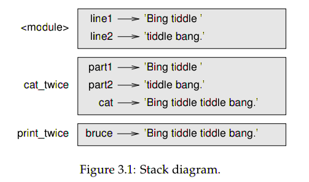

# 方法

1. 方法调用
   
2. 类型转换函数
   
   1. **int()** 可以转换成任何类型的值，除了含有非数字的字符串。
      
      * int(float)

        > **注意**：int can convert floating-point values to integers, but it doesn’t round off; it chops off the fraction part:
        ~~~ bash
        >>> int(1.999)
        >>> 1
        >>> int(-5.23)
        -5
        >>>
        ~~~

      * int(bool)
        ~~~ bash
        >>> int(T)
        Traceback (most recent call last):
          File "<stdin>", line 1, in <module>
        NameError: name 'T' is not defined
        >>> int(True)
        1
        >>> int(False)
        0
        ~~~

      * int(string)
        ~~~ bash
        >>> int('12345')
        12345
        >>> int('12a)
          File "<stdin>", line 1
            int('12a)
                    ^
        SyntaxError: EOL while scanning string literal
        ~~~

   2. **float** can convert integers and strings to floating-point numbers.
      
      * float(int)
        ~~~ bash
        >>> float(111)
        111.0
        ~~~

      * float(string)
        ~~~ bash
        >>> float('111')
        111.0
        >>> float('111b')
        Traceback (most recent call last):
          File "<stdin>", line 1, in <module>
        ValueError: invalid literal for float(): 111b
        ~~~

      * float(bool)
        ~~~ bash
        >>> float(T)
        Traceback (most recent call last):
          File "<stdin>", line 1, in <module>
        NameError: name 'T' is not defined
        ~~~

   3. **str** can convert any kinds of type to string.
      
      * str(int)
        ~~~ bash
        >>> str(11)
        '11'
        ~~~

      * str(float)
        ~~~ bash
        >>> str(11.11)
        '11.11'
        ~~~

      * str(bool)
        ~~~ bash
        >>> str(T)
        Traceback (most recent call last):
          File "<stdin>", line 1, in <module>
        NameError: name 'T' is not defined
        >>> str(True)
        'True'
        ~~~

3. 数学函数

   * 对数
     ~~~ bash
     import math
     >>> math.log10(100)
     2.0
     >>> math.log(math.e)
     1.0
     ~~~
    
   * 三角函数
     ~~~ bash
     >>> degrees = 45
     >>> radians = degrees / 360.0 * 2 * math.pi
     >>> math.sin(radians)
     0.7071067811865475
     ~~~
 
     \\(radians=\frac{π}{4}\\)

     \\(\sin{\frac{π}{4}}=\frac{\sqrt{2}}{2}\\)
 
   * math.e
     ~~~ bash
     >>> math.exp(1)
     2.718281828459045
     >>> math.e
     2.718281828459045
     ~~~
    
4. Composition
    
   > **注意**：
   > the left side of an assignment statement has to be a variable name. Any other expression on the left side is a syntax error (we will see exceptions to this rule later).
     ~~~ bash 
     >>> hours = 1
     >>> minutes = hours * 60
     >>> hours * 60 = minutes
       File "<stdin>", line 1
     SyntaxError: can't assign to operator
     ~~~

5. 添加新的方法：
   
   * 关于方法名称需要注意的地方：
     1. 第一个字符不能是数字，其它位置可以是英语字母，数字或者一些标点符号。
     2. 不可以是关键字。
     3. 避免方法名称和变量名称相同。

   * **定义函数的同时会创建一个同名的变量**
     ~~~ bash
     >>> def first():
     ...    print 'hello world'
     ... 
     >>> first
     <function first at 0x7fe5331582a8>
     >>> type(first)
     <type 'function'>
     ~~~
     The value of first is a **function object**, which has type 'function'.
   
   * 一旦你定义了一个函数，你就可以在其它函数中使用该函数了。

6. **定义和使用**
    
   ~~~ python
   def print_lyrics():
      print "I am a lumberjack, and I'm okay."
      print "I sleep all night and I work all day."

   def repeat_lyrics():
      print_lyrics()
      print_lyrics()

   repeat_lyrics()
   ~~~

   * Exercise 3.1：Move the last line of this program to the top, so the function call appears before the definitions. Run the program and see what error message you get.
     ~~~ python
     repeat_lyrics()

     def print_lyrics():
        print "I am a lumberjack, and I'm okay."
        print "I sleep all night and I work all day."

     def repeat_lyrics():
        print_lyrics()
        print_lyrics()
     ~~~
  
     ~~~ bash
     # 运行结果
     [helen@zhangyingyun Python]$ python lyrics.py 
     Traceback (most recent call last):
       File "lyrics.py", line 1, in <module>
         repeat_lyrics()
     NameError: name 'repeat_lyrics' is not defined
     ~~~
   * Exercise 3.2：Move the function call back to the bottom and move the definition of print_lyrics after the definition of repeat_lyrics. What happens when you run this program?
     ~~~ python
     def repeat_lyrics():
        print_lyrics()
        print_lyrics()

     def print_lyrics():
        print "I am a lumberjack, and I'm okay."
        print "I sleep all night and I work all day."

     repeat_lyrics()  
     ~~~
     
     ~~~ bash
     # 运行结果
     I am a lumberjack, and I'm okay.
     I sleep all night and I work all day.
     I am a lumberjack, and I'm okay.
     I sleep all night and I work all day.
     ~~~

7. **执行流程**

   Python is good at keeping track of where it is, so each time a function completes, the program picks up where it left off in the function that called it. When it gets to the end of the program, it terminates.

8. **Parameters（形式参数）& arguments（实际参数）**
    
   * Inside the function, the arguments are assigned to variables called *parameters*.

   * The argument is evaluated before the function is called.
     ~~~ bash
     >>> def print_greeting(saying):
     ...    print saying
     ...    print saying
     >>> print_greeting('hello world ' * 3)
     hello world hello world hello world 
     hello world hello world hello world 
     ~~~

9. **Variables and parameters are local**
   
   When a function terminates, the variables in this function are destroyed.
   
   ~~~ python
   def cat_twice(part1, part2):
      cat = part1 + part2
      print_twice(cat)

   def print_twice(bruce):
      print bruce
      print bruce
   
   line1 = 'Bing tiddle'
   line2 = 'tiddle bang.'
   cat_twice(line1, line2)
   ~~~
  
   

10. Stack diagrams（堆栈图）
   
    ~~~ python
    def cat_twice(part1, part2):
      cat = part1 + part2
      print_twice(cat)

   def print_twice(bruce):
      print cat
      print bruce
      print bruce

   line1 = 'Bing tiddle'
   line2 = 'tiddle bang.'
   cat_twice(line1, line2)
   ~~~
   
   ~~~ bash
   # 运行结果
   [helen@zhangyingyun Python]$ python trackback.py 
   Traceback (most recent call last):
     File "trackback.py", line 12, in <module>
       cat_twice(line1, line2)
     File "trackback.py", line 3, in cat_twice
       print_twice(cat)
     File "trackback.py", line 6, in print_twice
       print cat
   NameError: global name 'cat' is not defined
   ~~~
   
   上面这个叫做 **trackback**：It tells you what program file the error occurred in, and what line, and what functions were executing at the time. It also shows the line of code that caused the error.

11. **Fruitful functions and void functions**
    
    * 能够 yield result 的函数才被作者认为是 Fruitful function。
    * 相反，没有返回值的就是 void function 了。
      
      > **注意**：
      > ~~~ bash
        >>> p = print_twice('hello BigData')
        hello BigData
        hello BigData
        >>> p
        >>> print p
        None
        ~~~  
      >
      > The value **None** is not the same as the string *'None'*. It is a special value that has its own type:
        ~~~ bash
        >>> type(None)
        <type 'NoneType'>
        ~~~ 

12. **Why functions?**

    * 方法使程序变得更加简单
    * 避免重复写同一份代码
    * 易于调试
    * 可以重复多次使用

13. **Importing with from**
    
    **module**: A file that contains a collection of related functions and other definitions.

14. Debugging

15. Glossary

16. **Exercise**

    * *Exercise 3.4.*：Define a new function called *do_four* that takes a function object and a value and calls the function four times, passing the value as a parameter. There should be only two statements in the body of this function, not four.
      ~~~ python
      def do_twice_func(func, argu_from_func):
         func(argu_from_func)
         func(argu_from_func)

      def printSth(thing):
         print thing

      do_twice_func(printSth, 'hello python')

      def do_four_func(func, argu_from_func):
         do_twice_func(func, argu_from_func)
         do_twice_func(func, argu_from_func)

      do_four_func(printSth, 'hello python, hello world')
      ~~~
   
   * *Exercise 3.5.*：输出一个图形。
     ~~~ python
     # _*_ coding:utf-8 _*_

     # 行
     r = 0
     # 列
     c = 0

     for i in range(11):
        for j in range(11):
           if i % 5 == 0 and j % 5 == 0:
              print '+',
           elif i % 5 == 0 and not j % 5 == 0:
              print '-',
           elif not i % 5 == 0 and j % 5 == 0:
              print '|',
           else:
              print ' ',
        print '\n', # print '' 
     ~~~        
   
     ~~~ bash
     # 输出结果
     + - - - - + - - - - + 
     |         |         | 
     |         |         | 
     |         |         | 
     |         |         | 
     + - - - - + - - - - + 
     |         |         | 
     |         |         | 
     |         |         | 
     |         |         | 
     + - - - - + - - - - +
     ~~~
