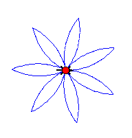
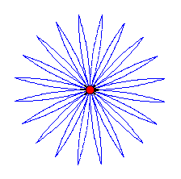
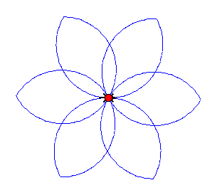
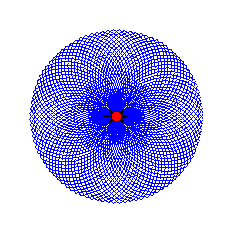
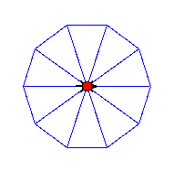

# Case study: interface design

1. TurtleWorld
    
   * A **package** is a collection of modules.

   * If Swampy is installed as a package on your system, you can import *TurtleWorld* like follow:
     ~~~ python
     from swampy.TurtleWorld import *
     ~~~ 
  
   * If you downloaded the Swampy modules but did not install them as a package, you can either work in the directory that contains the Swampy files, or add that directory to Python’s search path. Then you can import *TurtleWorld* like follow:
     ~~~ python
     from TurtleWorld import *
     ~~~

     > **将外部模块添加到 python 搜索目录中的方法**：
     > 1. 在 python 的交互模式下执行： 
          ~~~ bash
          >>> import sys
          >>> sys.path
          ['', '/usr/lib/python2.7/site-packages/SimpleGUICS2Pygame-01.09.00-py2.7.egg', '/usr/lib64/python27.zip', '/usr/lib64/python2.7', '/usr/lib64/python2.7/plat-linux2', '/usr/lib64/python2.7/lib-tk', '/usr/lib64/python2.7/lib-old', '/usr/lib64/python2.7/lib-dynload', '/usr/lib64/python2.7/site-packages', '/usr/lib64/python2.7/site-packages/Numeric', '/home/helen/workspace/Del_Tool/python/swampy-2.1.7/build/lib/swampy', '/usr/lib64/python2.7/site-packages/gtk-2.0', '/usr/lib64/python2.7/site-packages/wx-2.8-gtk2-unicode', '/usr/lib/python2.7/site-packages']
          ~~~
     > 2. 在 */usr/lib64/python2.7/site-packages* 目录中添加一个以 **.pth** 结尾的文件，在文件中写入外部模块所在的路径，保存，就大功告成啦！

   * **画出正方形**
     ~~~ python
     # _*_ coding: utf-8 _*_

     from TurtleWorld import *

     world = TurtleWorld()
     bob = Turtle()
     # 设置乌龟的初始地点
     pu(bob)
     fd(bob, 300)
     rt(bob, 90)
     fd(bob, 300)

     # 设置让乌龟留下痕迹
     pd(bob)
     def myploygon(staff, n, l):
        """
           staff 就是画出图形的小乌龟
           n 就是该图形的边数
           l 就是边的长度
        """
        i = 0
        a = 360 / n
        for i in range(n):
           fd(staff, l)
           lt(staff, a)
     myploygon(bob, 4, 10)
     wait_for_user()
     ~~~

2. **Simple repetition**

   指的就是上面用的 for 方法。

3. 练习画圆：
   ~~~ bash
   # _*_ coding:utf-8 _*_

   from space import *
   from math import *
     
   world = TurtleWorld()
   bob = Turtle()
   # 设置乌龟的初始地点 
   pu(bob)
   fd(bob, 300)
   rt(bob, 90)
   fd(bob, 300)
     
   # 设置让乌龟留下痕迹 
   pd(bob)
   def circle(t, r):
      n = 100
      l = 2.0 * pi * r / n
      myploygon(t, n, l)
    
   circle(bob, 50)
   ~~~

4. **Encapsulation**（封装）

   * Wrapping a piece of code up in a function is called **encapsulation**.
   * Benefit0:It attaches a name to the code, which serves as a kind of documentation.
   * Benefit1: if you re-use the code, it is more concise to call a function twice than to copy and paste the body!

5. **Generalization**（泛化） 
   
   * Adding a parameter to a function is called **generalization**.
   * **keyword arguments**
     * If you have more than a few numeric arguments, it is easy to forget what they are, or what order they should be in. It is legal, and sometimes helpful, to include the names of the parameters in the argument list. 写上形式参数的名称，顺序就可以任意了。

       ~~~ bash
       myploygon(bob, n = 10, l = 50)
       ~~~
 
       或
       ~~~ bash
       myploygon(l = 50, staff = bob, n = 10)
       ~~~      

6. **Interface design**
   * The **interface** of a function is a summary of how it is used: 
     * what are the parameters?
     * what does the function do?
     * what is the return value?
   
   * An interface is **"clean"** if it is "as simple as possible, but not simpler."
     * 该小节中，作者举了一个如何优化接口的例子：
       ~~~ python
       def circle(t, r):
          circumference = 2 * pi * r
          n = 50
          length = circumference / n
          polygon(t, n, length)
       ~~~
  
       在上面这个函数中，作者为了做到让该接口看起来尽可能的 simple，而舍弃了在参数中加上 n。所以问题出现了：一个固定的 n，意味着当我想要看到一个大大的圆而提供了一个大大的 r 时，length 也随即变大了，这会导致圆已不再是圆的窘境；而当我想要一个小小的圆而提供了一个小小的 r 时，length 又会变的非常小，圆是更圆了，不过耗费的时间也长了。于是作者给出了一个办法，让 n 与圆的周长成正比，当圆比较大时，n 也随即变大，反之亦然。
       ~~~ python
       def circle(t, r):
          circumference = 2 * pi * r
          n = int(circumference / 3) + 1
          length = circumference / n
          polygon(t, n, length)
       ~~~
 
7. **Refactoring**（重构）
   * 这里作者给出的定义是：重新安排程序以升级函数的接口并使得代码可以重用的过程我们称为**重构**。下面用实例说话：
     ~~~ python
     # 生成多边形的函数
     def ploygon(t, n, length):
        angle = 360.0 / n

        for i in range(n):
           fd(t, length)
           lt(t, angle)

     # 生成弧的函数
     def arc(t, r, num):
        angle = 360.0 / n
        arc_length = 2 * math.pi * r * angle / 360
        n = int(arc_length / 3) + 1
        step_length = arc_length / n
        step_angle = float(angle) / n

        for i in range(num):
           fd(t, step_length)
           lt(t, step_angle)
     ~~~

     细看可知，以上两个函数中都有如下循环语句，为了避免每次都重新写一次这样的结构，所以我们将其提取出来并包装成一个函数，以便下次使用。
     ~~~ python
     for i in range(n):
        fd(t, length)
        tl(t, angle)
     ~~~
     
     将上面的循环体写成函数：
     ~~~ python
     def draw(t, n, length, angle):
        for i in range(n):
           fd(t, length)
           lt(t, angle)
     ~~~
     
     于是乎，新的多边形函数和弧函数就成了下面这样：
     ~~~ python
     def ploygon(t, n, length):
        angle = 360.0 / n
        draw(t, n, length, angle)

     def arc(t, r, num):
        angle = 360.0 / num
        arc_length = 2 * math.pi * r * angle / 360
        n = int(arc_length) / 3 + 1
        step_length = arc_length / num
        step_angle = float(angle) / num
        draw(t, n, step_length, step_angle)    
     ~~~     

8. A development plan
   
   1. 首先写一些代码出来，可以没有函数。
   2. 一旦这段代码可以运行成功，将这段代码封装起来并提供一个函数名称。
   3. 泛化这段函数，即添加一些合适的参数。
   4. 重复 1 - 3 的步骤，写出一些函数出来。
   5. 寻找可以重构代码的机会。例如，当你看到有一段代码被重复使用了，可以考虑将代码重构了。

9. **docstring**
   
   * A docstring is a string at the beginning of a function that explains the interface.
     ~~~ python
     def arc(t, r, angle):
        """Draws an arc with the given radius and angle.
        t: Turtle
        r: radius
        angle: angle subtended by the arc, in degrees
        """
        arc_length = 2 * math.pi * r * abs(angle) / 360
        n = int(arc_length / 4) + 1
        step_length = arc_length / n
        step_angle = float(angle) / n

        # making a slight left turn before starting reduces
        # the error caused by the linear approximation of the arc
        lt(t, step_angle/2)
        polyline(t, n, step_length, step_angle)
        rt(t, step_angle/2)
        ~~~     

   * This docstring is a triple-quoted string, also known as a multiline string because the triple quotes allow the string to span more than one line. 例如：
     ~~~ bash
     >>> print """a
     ... b
     ... c
     ... d
     ... e
     ... f
     ... g
     ... """
     a
     b
     c
     d
     e
     f
     g

     >>> print 'a # 在输入 a 之后，回车
       File "<stdin>", line 1
         print 'a
                ^
     SyntaxError: EOL while scanning string literal
     >>> print 'a\nb\n'
     a
     b

     ~~~

10. Debugging   
       
11. Glossary

12. Exercise
    
    * Exercise 4.2. 
      ~~~ python
      # _*_ coding:utf-8 _*_

      from TurtleWorld import *
      import math

      world = TurtleWorld()
      bob = Turtle()

      def arc(t, r, num):
         angle = 360.0 / num
         arc_length = 2 * math.pi * r * angle / 360
         n = int(arc_length / 3) + 1
         step_length = arc_length / n
         step_angle = float(angle) / n
         for f in range(num):
            for i in range(n):
               fd(t, step_length)
               lt(t, step_angle)
               #fd(t, step_length)

            lt(t, 180 - angle)

            for j in range(n):
               fd(t, step_length)
               lt(t, step_angle)

            rt(t, 180)

      bob.delay = 0.01
      # num 是叶子的数量
      arc(bob, r = 90, num = 7)
      ~~~
      
      以上代码执行后的结果：

      

      下图是 10 片叶子的图形：

      

      ~~~ python
      # _*_ coding:utf-8 _*_

      from TurtleWorld import *
      import math

      world = TurtleWorld()
      bob = Turtle()

      def arc(t, r, num):
         angle = 360.0 / num
         arc_length = 2 * math.pi * r * angle / 720
         n = int(arc_length / 3) + 1
         step_length = arc_length / n
         step_angle = float(angle) * 2.0 / n
         for f in range(num):
            for i in range(n):
               fd(t, step_length)
               lt(t, step_angle)
               #fd(t, step_length)

            lt(t, angle)

            for j in range(n):
               fd(t, step_length)
               lt(t, step_angle)

            lt(t, 180 - angle)

      bob.delay = 0.01
      # num 是叶子的数量
      arc(bob, r = 300, num = 6)
      wait_for_user()
      ~~~
      
      画出的图形：

      
      
      ~~~ python
      # 通用方法，由使用者手动修改叶子的数量的既可
      from TurtleWorld import *
      import math

      world = TurtleWorld()
      bob = Turtle()

      def angle_(num):
         if num == 3:
            return 180
         else:
            f = math.log(num / 3, 2)
            a = angle_(3 * 2 ** (f - 1))
            a = a - 60 / (2 ** (f - 1))
            return a

      def arc(t, r, num):
         angle = 360.0 / num
         arc_length = 2 * math.pi * r * (1 / 3.0)
         n = int(arc_length / 3) + 1
         step_length = arc_length / n
         step_angle = 120.0 / n

         for f in range(num):
            for i in range(n):
               fd(t, step_length)
               lt(t, step_angle)

            lt(t, 60)

            for j in range(n):
               fd(t, step_length)
               lt(t, step_angle)

            lt(t, angle_(num))

      bob.delay = 0.01
      # num 是叶子的数量arc(bob, r = 300, num = 12)
      arc(bob, r = 50, num = 192)
      wait_for_user()
      ~~~

      下面叶子数为 96 时的图形：
      叶子的片数是有一定要求的：3 * 2 ** n

      
  
    * Exercise 4.3.
      ~~~ python
      # _*_ coding:utf-8 _*_

      from TurtleWorld import *
      from math import cos, pi

      world = TurtleWorld()
      bob = Turtle()

      def shape(t, n, l):
         """
         n: 边的数量
         l: 左右边长
         """
         # A: 顶角
         A = 360.0 / n

         # a: 边角
         a = (180 - A) / 2.0

         # d: 底边长
         angle = 2 * pi * a / 360.0 
         d = 2.0 * cos(angle) * l

         for i in range(n):
            fd(t, l)
            lt(t, (180 - a))
            fd(t, d)
            lt(t, (180 - a))
            fd(t, l)
            lt(t, 180)

      bob.delay = 0.01
      shape(bob, 10, 50)
      wait_for_user()
      ~~~
      
      10 边形，如下图：

       

      > **注意：**
      >
      > **凡是进行三角运算的都要将数值换算成弧度角啊！长记性啊！！！**
      > ~~~ python
        angle = 2 * pi * a / 360.0
        ~~~

    * 螺旋
      ~~~ python
      # _*_ coding:utf-8 _*_

      from TurtleWorld import *
      from math import *

      def spiral(t, n, right_angle_side1, angle):
         global Angle
         global side
         Angle = angle
         angle_radian = Angle * pi / 180
         right_angle_side0 = float(right_angle_side1) / tan(angle_radian)
         side = float(right_angle_side1) / sin(angle_radian)
         pu(t)
         fd(t, 800)
         rt(t, 90)
         fd(t, 300)
         pd(t)
         fd(t, right_angle_side0)
         lt(t, 90)

         def draw():
            global side
            global Angle
            fd(t, right_angle_side1)
            lt(t, Angle)
            Angle_radian = atan(right_angle_side1 / float(side))
            # 注意！Angle_radian 是从 atan() 这个三角函数出来的，所以需要将其转换为角度角才能用于画图函数 fd() 等。
            Angle = Angle_radian * 180 / pi
            side = float(right_angle_side1) / sin(Angle_radian)

         for i in range(n):
            print '-----'
            print Angle
            print '====='
            print side
            draw()

      world = TurtleWorld()
      bob = Turtle()
      bob.delay = 0.001
      spiral(bob, 2000, 5, 60)
      wait_for_user()
      ~~~ 
     
      > **注意：**：三角函数外面的都用角度角；三角函数里面的都用弧度角。
